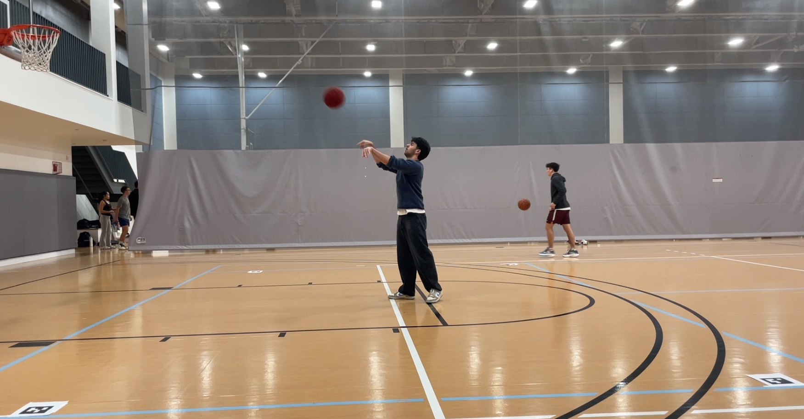
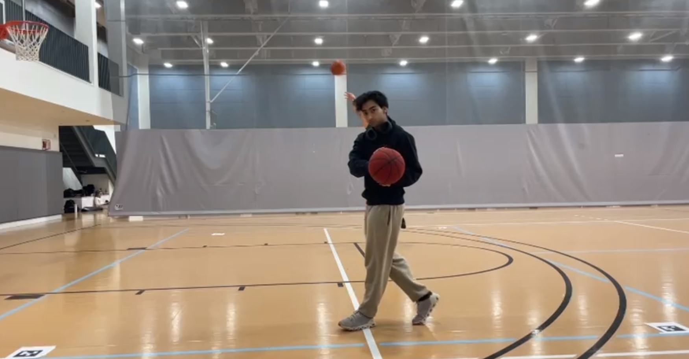
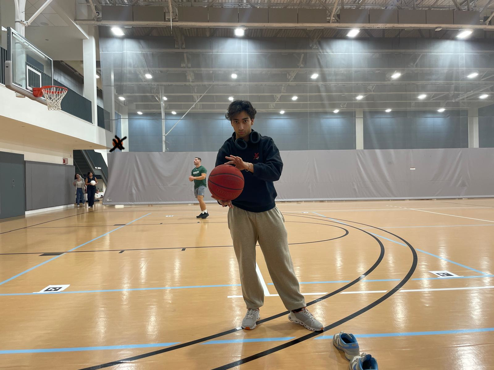
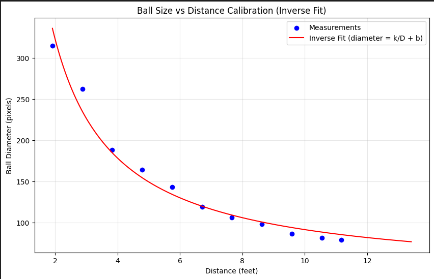
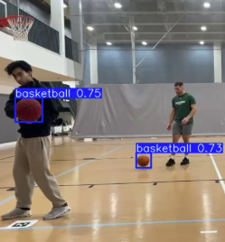
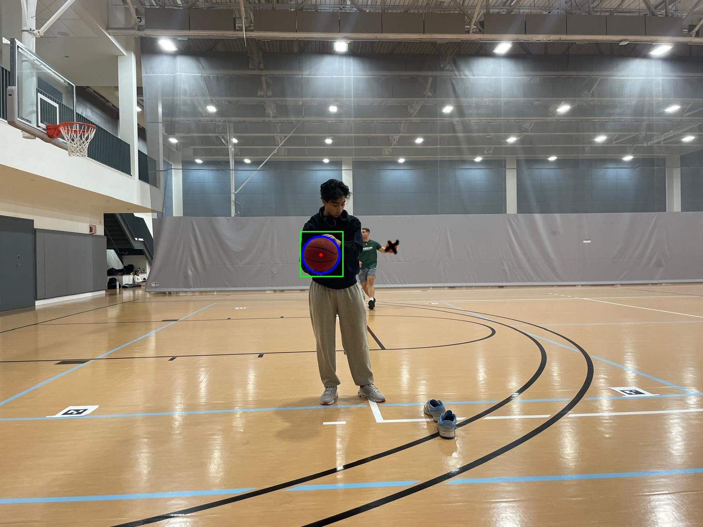

# basbetball-tracker
By: Zaraius Bilimoria, Satchel Schiavo

## Overview
We wanted to explore central machine vision topics of identifying an object and its position in 3D space, as well as determining its trajectory and estimating some kinematics of objects. We were hoping to frame this as analyzing a basketball as it is shot around the court, identifying its position, trajectory, velocity, and when it goes into a hoop.

## Data collection
We collected two videos and a series of photos for our data. All data was taken from an iPhone 12 Pro's camera, and a constant position and orientation between filming. We collected one 'real' video of us playing basketball and trying our best to mimic movements that would occur in a basketball game, e.g passing, dribbling, and shooting. This video was semi-random so we could ensure our scripts would work with a generic basketball game. You can tell the footage is real because we never made a single 3 point shot. This was at a series of unknown depths from the camera. We attempted to place Aruco tags for easy identification and real-world distances, but found that the camera couldn't accurately identify the tags, and ended up using ball size to estimate position instead. You can see the Aruco tags in our video, however.

Additionally, we filmed a video "side_by_side" to use for calibration of our ball tracking and kinematics scripts. As the title would suggest, the video shows Zaraius moving at a relatively constant speed moving right-to-left in the camera frame, holding the ball at a constant height and depth. This way, we can use the footage to validate our trajectory tracking by overlaying it over the video and looking for errors, and we can compare both the components and magnitude of velocity of our script. This was at a known depth from the camera.

Finally, we took a series of photos of the ball at a constant x and y position, but different z (depths). We measured each photo's depth and compared that to the size of the basketball in the image to create a pixel-to-depth calibration. Later on in this report, we use a Hough transformation to clearly identify the diameter of a basketball, and obtain a clearer depth. 

With our known distance and diameter of the ball in pixels, we calculated a calibration curve

You may see some other students playing basketball in our videos. We told them ahead of time we would be filming and asked them not to play in our court, but unfortunately a few new students joined who were unaware. All students who appear in videos were told about them and allowed us to use the video, with the understanding we would not be tracking them. This provided us with a few new challenges like what do we do when we identify multiple balls, but ultimately did not really affect our final project.

## Ball Detection
The first part of this requires us to identify the position of the ball in x and y (and eventually z). We first need to find the ball in the camera frame. Our initial approach was to try a color mask to separate the ball and the background but we quickly realized this was an impossible task. The ball wouldn't always have consistent HSV values because of varying lighting and shadows. On top of this, the floor and backdrop had similar hues as the ball.

This led us to try using an object identification model. We started with the yolov11n object identification model and trained on a dataset of basketballs we found on the internet. 
https://universe.roboflow.com/eagle-eye/basketball-1zhpe

After training this model we tested it out on a test video and noticed that it was good at generally finding the basketball, it missed a lot, especially when the ball was far away or slightly covered. We ran a script(create_frames.py) which generated 50 annotated images and we manually fixed the annotations. We split these 50 images back into the train, test, validate and retrained the model. This is done when training models to prevent the model from "cheating". It learns from the training data and adjusts its internal parameters. The model is tested on the validation data, which is used to make decisions such as when to stop training to prevent overfitting. The test data is never seen before and is used to see how good your model is on new data. With this new model we are able to consistently get a bounding box for the ball. 

At first we were hoping that this bounding box would be good at giving us the x and y position of the ball, and also allow us to calculate z by knowing how big it is. However when we looked at the video we realized the bounding box wasn't always tight around the ball and its size varied. We needed a way to detect the ball precisely, with knowing its general location.
For this we used Hough Circle Transform which takes in input parameters such as the inverse ratio of resolution, min radius of ball, threshold for center detection, etc. Using this algorithm we were able to get a very good detection of the ball

## Basic Physics Modeling 
We began by attempting to use Aruco tags in order to find values for real-world distances from the videos, but found it too difficult to capture the full court with our camera and have enough image resolution to identify tags. Instead we estimated distance by comparing ball diameter. We pass in the x, y and z which we calculated from yolo model + hough circle transform(in segmentation.py) to identify the ball's position across 10 frames, and compare the distances between frames as well as the fps to find average velocity in pixels per seconds (px/s). We can then compare ball diameter in pixels to the known quantity in feet to finally showcase our ball's velocity.

Our final video overlays the original video and tells you average speed and z position, as well velocity and acceleration in x,y and z, although these numbers are far from accurate

## Challenges
Our biggest challenges were from creating an accurate transformation from camera frame to world frame. In our ideation phase, we had suggested multiple different approaches for this problem, including a secondary camera, Aruco tags, or possibly even stereo cameras. However, we ran into difficulties in setting up a multi-camera layout in the LGRAC gym, as well as hardware limitations of finding a camera with some depth information. In the end, we decided to use one camera and find distance purely from the diameter of the ball, as the was the simplest implementation. We developed a calibration model to still find distance, but we still found that with our frame-by-frame calculations for velocity and acceleration, there was a lot of 'distance noise' that inflated our average speed and distances. Ultimately if we were to continue this project, we would want a different setup with multiple cameras, or more images in our depth perception calibration to account for differences in lighting and height.

As mentioned in our Data Collection section, our final video had sections with multiple basketballs, which confused our scripts initially. Distinguishing between different balls in videos proved challenging, as even using a Kalman filter to normalize position by previous ones was ineffective, resulting in impossibly large velocities as a result of our scripts catching both balls. We had to manually edit some data to color over the basketballs to prevent detection.

Depth readings
Finding the depth of the ball was really hard. Firstly, the hough circle transform was very good for most of the images but there were still several frames where it wouldn't be accurate because of things like lighting. Secondly, our calibration data was only until ~12 feet away from the camera and in our video, the ball is often more than 30 feet away from the camera. Without good calibration, our diameter to size conversion can't be accurate.

(Our REAL biggest challenge was trying to play basketball well. Please do not show our final video to anyone outside the teaching team.)

## Learnings/Conclusions

Our biggest learning is that while classifying an image or identifying an object within an image is easy, actually using it for fairly granular, precise information like distance or speed needs a higher fidelity sensor or lighting. Attempting to estimate using the given information from a basic camera leads to many inaccuracies, and our computer vision model isn't flexible to handle those inconsistencies.

Our initial scope included detecting successful shots but we didn't get to that due to significant challenges in getting reliable 3D tracking. If we had more time we would try to improve our 3D tracking and try to detect when it goes in the hoop.

In terms of project management, we learned that even with taking the first few days of the project to plan out our camera station, ultimately we cannot predict the different methods (stereo camera, multiple cameras, single, etc) or the challenges associated with them. It would be interesting to take another method and compare difficulty with it as well as accuracy of results. Also, saving time with a simpler setup isn't worth the additional time spent correcting inaccurate results.